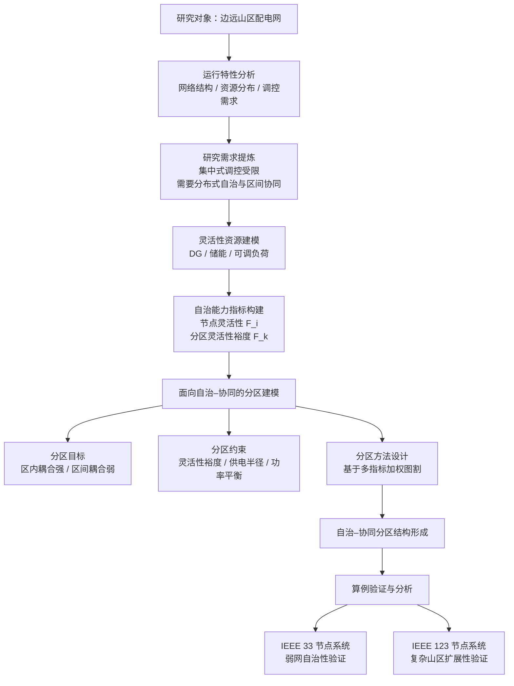

```mermaid
flowchart TB
    A[研究对象：边远山区配电网] 

    A --> B[运行特性分析<br/>网络结构 / 资源分布 / 调控需求]

    B --> C[研究需求提炼<br/>集中式调控受限<br/>需要分布式自治与区间协同]

    C --> D[灵活性资源建模<br/>DG / 储能 / 可调负荷]

    D --> E[自治能力指标构建<br/>节点灵活性 F_i<br/>分区灵活性裕度 F_k]

    E --> F[面向自治–协同的分区建模]
    
    F --> F1[分区目标<br/>区内耦合强 / 区间耦合弱]
    F --> F2[分区约束<br/>灵活性裕度 / 供电半径 / 功率平衡]

    F --> G[分区方法设计<br/>基于多指标加权图割]

    G --> H[自治–协同分区结构形成]

    H --> I[算例验证与分析]

    I --> I1[IEEE 33 节点系统<br/>弱网自治性验证]
    I --> I2[IEEE 123 节点系统<br/>复杂山区扩展性验证]

```